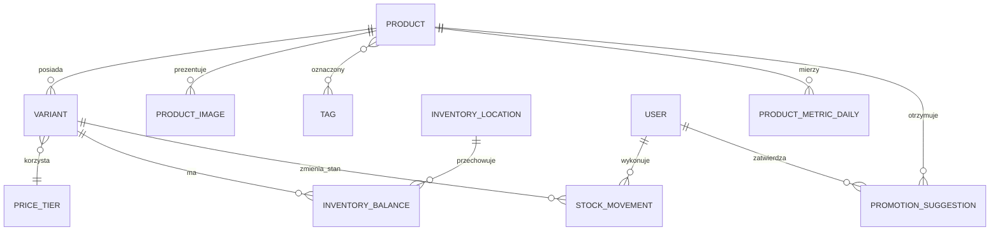

# Model katalogu Relax

Ten model jest przygotowany pod sklep internetowy, panel dla kilku pracowników i PostgreSQL. Nie wymaga kodów producenta ani kodów kreskowych. Towar można zacząć spisywać po nazwach używanych obecnie w sklepie, a identyfikatory techniczne system utworzy sam.

## Najważniejsza zasada

**Produkt** opisuje model widoczny dla klienta, na przykład „Flamingi”. **Wariant** opisuje konkretną rzecz możliwą do sprzedania, na przykład „Flamingi / zielone / 36–38”. Stan magazynowy i cena dotyczą wariantu, ponieważ ten sam wzór może mieć różne rozmiary, kolory i progi cenowe.

Przykład:

- produkt: `Flamingi`, skarpety Relax, kolekcja kolorowa,
- wariant 1: zielone, 36–38, próg cenowy 2, 12 sztuk online,
- wariant 2: zielone, 39–42, próg cenowy 2, 8 sztuk online,
- wariant 3: niebieskie, 39–42, próg cenowy 2, 4 sztuki online.

## Struktura danych

### Produkt

| Pole | Znaczenie |
|---|---|
| `id` | Techniczny UUID nadawany automatycznie. |
| `product_key` | Krótki stabilny klucz do grupowania wariantów, np. `flamingi`. |
| `working_name` | Nazwa używana przez rodzinę i pracowników. |
| `display_name` | Nazwa widoczna w sklepie internetowym. |
| `slug` | Adres produktu generowany z nazwy, np. `/produkt/flamingi`. |
| `category` | Skarpety, stopki, rajstopy lub później inna kategoria. |
| `source_type` | `RELAX` dla własnej produkcji albo `EXTERNAL` dla towaru kupowanego. |
| `manufacturer` | Pełna nazwa producenta. |
| `manufacturer_address`, `manufacturer_email` | Dane kontaktowe producenta widoczne w ofercie. |
| `responsible_person*` | Nazwa, adres i e-mail podmiotu odpowiedzialnego w UE, gdy ma zastosowanie. |
| `country_of_origin` | Kraj pochodzenia potwierdzony dla danego produktu. |
| `audience` | Dzieci, dorośli, uniwersalne. |
| `description` | Opis dla klienta. Może pozostać pusty podczas pierwszego spisu. |
| `materials` | Dokładny skład surowcowy widoczny przed zakupem. |
| `care_instructions` | Sposób prania i pielęgnacji. |
| `safety_information` | Wymagane informacje lub ostrzeżenia dotyczące bezpieczeństwa. |
| `status` | `DRAFT`, `ACTIVE`, `ARCHIVED`. |
| `published` | Czy produkt jest widoczny dla klientów. |

### Wariant

| Pole | Znaczenie |
|---|---|
| `id` | Techniczny UUID. |
| `product_id` | Powiązanie z produktem. |
| `sku` | Wewnętrzny kod. Może zostać wygenerowany automatycznie. |
| `barcode` | Kod kreskowy, jeżeli kiedyś się pojawi; teraz opcjonalny. |
| `size_label` | Dokładny zapis z metki, np. `36–38`. Nie zakładamy jednej tabeli rozmiarów. |
| `color_name` | Nazwa koloru używana przez pracowników. |
| `pattern_name` | Wzór, jeśli sam kolor nie wystarcza do rozróżnienia. |
| `price_tier_id` | Wybrany próg cenowy. |
| `price_override_gross` | Opcjonalna indywidualna cena brutto zamiast progu. |
| `vat_rate` | Stawka VAT potwierdzona przed uruchomieniem sprzedaży. |
| `active` | Czy wariant można obecnie zamawiać. |

Unikalność wariantu sprawdzamy po produkcie, rozmiarze, kolorze i wzorze. System ostrzega przed duplikatem, ale pracownik może poprawić nazwę przed zapisaniem.

### Progi cenowe

Progi są edytowalne w panelu, na przykład:

| Nazwa | Cena brutto | Zastosowanie |
|---|---:|---|
| Próg 1 | do ustalenia | Tańsze modele. |
| Próg 2 | do ustalenia | Standardowe modele. |
| Próg 3 | do ustalenia | Droższe lub specjalne modele. |

Zmiana kwoty progu może zmienić cenę wszystkich podpiętych wariantów. Panel musi przed zapisaniem pokazać liczbę produktów objętych zmianą i wymagać świadomego zatwierdzenia. Pojedynczy wariant może mieć własną cenę, jeśli nie pasuje do żadnego progu.

### Stan internetowy

Stan prowadzimy przez lokalizacje magazynowe. Na start istnieje tylko `ONLINE`, czyli zapas odłożony na piętrze dla sklepu internetowego. Sklep fizyczny nie jest automatycznie synchronizowany.

Każdy wariant ma:

- `on_hand` — fizyczna liczba sztuk w magazynie internetowym,
- `reserved` — sztuki z rozpoczętych lub nieopłaconych zamówień,
- `available` — wartość wyliczana jako `on_hand - reserved`,
- `low_stock_threshold` — próg ostrzeżenia o małym stanie.

Każda zmiana zapisuje ruch magazynowy: przyjęcie, korekta, rezerwacja, zwolnienie rezerwacji, sprzedaż albo zwrot. Ruch przechowuje użytkownika, czas, ilość i komentarz. Dzięki temu trzy osoby mogą pracować równocześnie bez cichego nadpisywania stanów.

### Zdjęcia

Produkt ma zdjęcie główne i dodatkowe zdjęcia. Wariant może wskazać własne zdjęcie, jeśli kolor lub wzór wygląda inaczej. Nazwa pliku powinna zaczynać się od klucza produktu, na przykład:

`flamingi-zielone-36-38-01.webp`

Oryginały zachowujemy poza katalogiem publicznym. Na stronę trafiają zoptymalizowane pliki WebP lub AVIF.

### Tagi i kolekcje

Tagi można tworzyć bez zmiany kodu. Pierwszy sensowny zestaw:

- `bambusowe`, `bawełniane`,
- `dziecięce`, `dla dorosłych`,
- `kolorowe`, `klasyczne`,
- `święta`, `prezent`, `nowość`,
- `produkcja Relax`, `inna marka`.

Tag służy do filtrów, kolekcji sezonowych, newslettera i podpowiedzi promocji. Kategoria pozostaje stabilna; tag może być tymczasowy.

### Popularność i promocje

Popularność nie będzie ręcznie wpisanym procentem. System wyliczy ją z ostatnich 30 dni na podstawie odsłon produktu, dodań do koszyka i opłaconych sztuk. Panel pokaże wynik względny od 0 do 100 w obrębie kategorii oraz liczby źródłowe.

Automat może utworzyć **propozycję** promocji, na przykład dla popularnego produktu świątecznego albo wolno schodzącego stanu. Propozycja ma status `PENDING`, uzasadnienie, sugerowaną cenę i daty. Cena publiczna nie zmienia się, dopóki uprawniony człowiek nie wybierze „Zatwierdź”. Odrzucenie również zostaje zapisane.

## Automatyczny SKU

Brak obecnych numerów nie blokuje pracy. Po zapisaniu wariantu system może utworzyć czytelny kod, np. `RLX-SKA-FLAM-3638-ZIE`. Kod pozostaje stały nawet po zmianie nazwy produktu. Jeśli kolizja się powtórzy, system doda krótki numer.

SKU służy pracownikom i zamówieniom. Klient nie musi go widzieć.

## Pierwszy spis towaru

Plik `data/product-import-template.csv` jest przygotowany pod polskiego Excela i używa średników. Jeden wiersz oznacza jeden wariant. Na pierwszym przejściu wystarczy wypełnić:

1. `product_key`, `working_name`, `category`, `source_type`,
2. `size_label`, `color_name`, `pattern_name`,
3. `price_tier`, `stock_online`,
4. opcjonalnie tagi, producenta i nazwę zdjęcia.

Puste opisy, materiały, kody kreskowe i nazwy sklepowe można uzupełnić później w panelu. Produkt pozostaje szkicem, dopóki pole `published` nie otrzyma wartości `TAK`.

## Informacje potrzebne przed sprzedażą

Te braki nie blokują budowy katalogu, ale trzeba je potwierdzić przed przyjęciem pierwszej płatności:

- właściwe ceny progów i stawka VAT,
- zasady nadawania paragonów lub faktur,
- regulamin, polityka prywatności i procedura zwrotów,
- przewoźnicy, koszt dostawy i próg darmowej dostawy,
- operator płatności obsługujący BLIK,
- pełne dane firmy wymagane na stronie i dokumentach sprzedaży.
